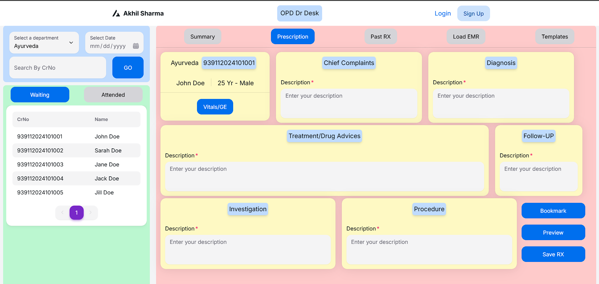

# OPD (Out-Patient Department) Doctor Desk

This is a simple web application for OPD Doctor Desk. It is a part of the Hospital Management System.

## Features
- Doctor can view the list of patients who are waiting for consultation.
- Doctor can view the patient details.
- Doctor can add prescription for the patient.
- Doctor can view the prescription history of the patient.

## Technologies
- React, Next.js
- GoLang

## How to run
- Clone the repository
- Run `npm install` to install the dependencies
- Run `npm run dev` to start the development server
- Access the application at `http://localhost:3000`

## Screenshots

## License
This project is licensed under the MIT License - see the [LICENSE](LICENSE) file for details.